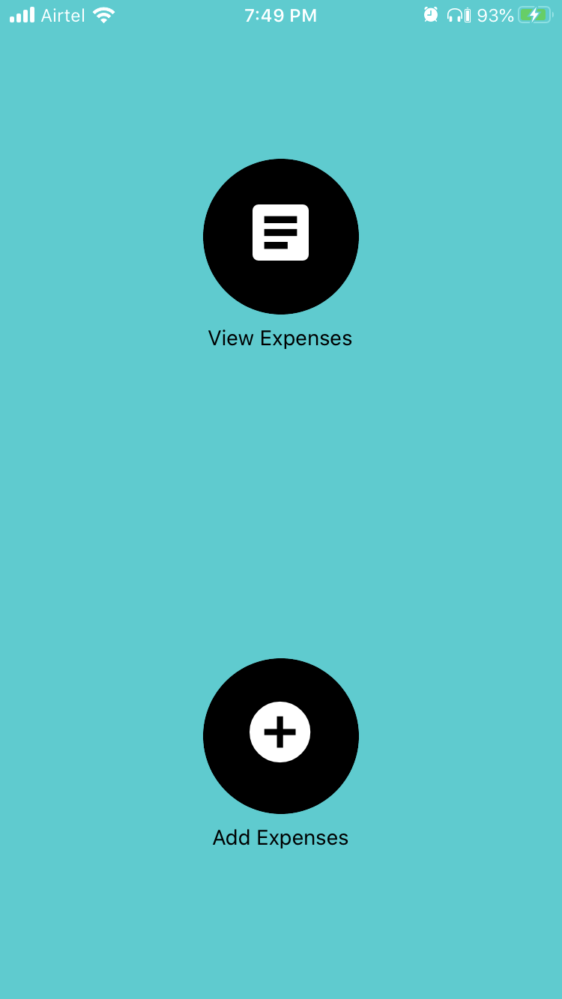
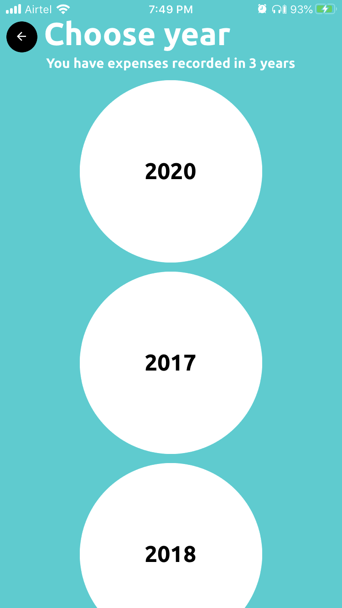
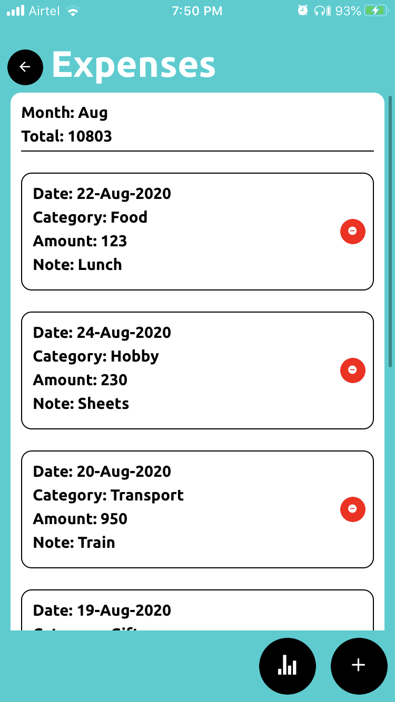
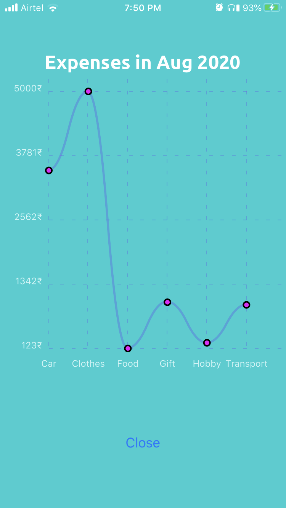

# ExpensesDiary
A mobile app for keeping track of daily expenses. Some visualizations are also provided for the monthly cumulative expenses.
Developed in react native using expo. 
This code can be used to build app for both android as well as iOS.

Packages used:
1. react-native
2. react-native-community/datetimepicker
3. expo-sqlite
4. react-native-elements
5. react-native-chart-kit

## Screenshots (iOS)
  

  

